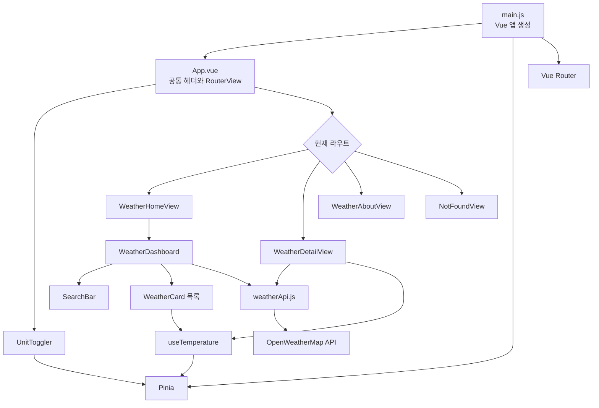

# Vue Weather Dashboard

Vue 3의 주요 기능을 한 프로젝트 안에서 익힐 수 있도록 만든 날씨 대시보드 SPA(Single Page Application)입니다. OpenWeatherMap의 현재 날씨 데이터를 불러와 서울·수원·부산의 날씨를 보여주며, 도시 검색, 상세 화면 이동, 섭씨/화씨 변환을 지원합니다.

이 프로젝트는 단순히 날씨를 표시하는 데 그치지 않고 다음 기술들이 실제 애플리케이션 안에서 어떻게 연결되는지 보여주는 학습용 예제입니다.

- Vue 3 Composition API와 `<script setup>`
- Vue Router를 이용한 화면 전환과 URL 상태 관리
- Pinia를 이용한 전역 상태 관리
- Axios를 이용한 외부 API 통신과 응답 데이터 정규화
- Element Plus 기반 UI 컴포넌트
- props/emit, slot, provide/inject, composable을 활용한 컴포넌트 설계

## 주요 기능

| 기능 | 설명 |
| --- | --- |
| 지역별 날씨 조회 | 서울, 수원, 부산의 현재 기온과 날씨 상태를 한 번에 조회합니다. |
| 도시 검색 | 입력한 한글 도시명이 포함된 카드만 실시간으로 필터링합니다. |
| 검색 URL 반영 | 검색어를 `?search=서울` 형태로 URL에 반영하고, 페이지 최초 진입 시 URL의 검색어를 사용합니다. |
| 상세 날씨 | 도시별 기온, 날씨 상태, 습도, 풍속을 별도 화면에서 확인합니다. |
| 온도 단위 전환 | 헤더의 스위치로 목록과 상세 화면의 표시 온도를 ℃/℉ 사이에서 전환합니다. |
| 유효하지 않은 경로 처리 | 등록되지 않은 도시 ID와 알 수 없는 경로를 404 화면으로 안내합니다. |
| 로딩·오류·빈 결과 처리 | API 요청 상태와 검색 결과 유무에 맞는 메시지를 표시합니다. |

## 기술 스택

| 구분 | 기술 | 프로젝트에서의 역할 |
| --- | --- | --- |
| 프레임워크 | Vue 3 | Composition API 기반 화면과 반응형 상태 구성 |
| 빌드 도구 | Vite | 개발 서버, 환경 변수 주입, 프로덕션 빌드 |
| 라우팅 | Vue Router | 홈·소개·상세·404 화면 연결, 도시 ID 검증 |
| 상태 관리 | Pinia | 모든 화면이 공유하는 온도 단위 관리 |
| HTTP 클라이언트 | Axios | OpenWeatherMap API 요청과 timeout 설정 |
| UI 라이브러리 | Element Plus | 입력창, 버튼, 스위치 제공 |
| 품질 도구 | ESLint, Oxlint, Oxfmt | 정적 검사와 코드 포맷팅 |

세부 버전은 [`package.json`](./package.json)에서 확인할 수 있습니다.

## 빠르게 실행하기

### 1. 사전 준비

- Node.js `20.19.0 이상` 또는 `22.12.0 이상`
- npm
- [OpenWeatherMap](https://openweathermap.org/api)의 API Key

### 2. 프로젝트 설치

```sh
npm install
```

### 3. 환경 변수 설정

예제 파일을 복사해 로컬 환경 변수 파일을 만듭니다.

```sh
cp .env.example .env.local
```

`.env.local`의 값을 발급받은 API Key로 교체합니다.

```dotenv
VITE_OPENWEATHER_API_KEY=발급받은_API_KEY
```

> `.env.local`은 개인 키를 담는 파일이므로 Git에 커밋하지 마세요. 환경 변수를 변경했다면 개발 서버를 다시 시작해야 합니다.

### 4. 개발 서버 실행

```sh
npm run dev
```

터미널에 표시되는 로컬 주소(기본값 `http://localhost:5173`)로 접속합니다.

## 사용 가능한 명령어

| 명령어 | 설명 |
| --- | --- |
| `npm run dev` | Vite 개발 서버를 실행합니다. |
| `npm run build` | 배포용 파일을 `dist/`에 생성합니다. |
| `npm run preview` | 생성된 `dist/` 빌드를 로컬에서 미리 확인합니다. |
| `npm run lint` | Oxlint와 ESLint 검사를 실행하고 가능한 문제를 자동 수정합니다. |
| `npm run format` | `src/` 내부 파일을 Oxfmt로 포맷팅합니다. |

프로덕션 빌드를 확인하려면 다음 순서로 실행합니다.

```sh
npm run build
npm run preview
```

## 화면과 라우트

| URL | 라우트 이름 | 화면 | 역할 |
| --- | --- | --- | --- |
| `/` | `WeatherHome` | `WeatherHomeView.vue` | 날씨 목록과 검색 화면 |
| `/?search=서울` | `WeatherHome` | `WeatherHomeView.vue` | URL 검색어로 초기화된 목록 화면 |
| `/weather/:cityId` | `WeatherDetail` | `WeatherDetailView.vue` | 선택한 도시의 상세 날씨 |
| `/about` | `WeatherAbout` | `WeatherAboutView.vue` | 프로젝트 소개 |
| `/not-found` | `NotFound` | `NotFoundView.vue` | 404 안내 |
| 그 외 경로 | - | `NotFoundView.vue`로 이동 | 알 수 없는 URL 처리 |

상세 화면에서 허용되는 도시 ID는 다음과 같습니다.

| 도시 ID | 도시 | 좌표 기준 |
| --- | --- | --- |
| `city_01` | 서울 | 37.5665, 126.9780 |
| `city_02` | 수원 | 37.2636, 127.0286 |
| `city_03` | 부산 | 35.1796, 129.0756 |

`router.beforeEach` 가드가 이 목록에 없는 `cityId`를 `/not-found`로 보냅니다. 홈 화면을 제외한 라우트 컴포넌트는 동적 import로 지연 로딩됩니다.

## 애플리케이션 구조



### 계층별 책임

- **진입점 (`main.js`)**: Vue 앱을 만들고 Pinia, Router, Element Plus를 등록합니다.
- **최상위 레이아웃 (`App.vue`)**: 모든 화면에서 공통으로 보이는 헤더, 내비게이션, 단위 스위치와 `<RouterView>`를 제공합니다.
- **View (`src/views`)**: URL에 직접 대응하는 페이지 단위 컴포넌트입니다.
- **UI 컴포넌트 (`src/components/weather`)**: 검색창, 날씨 카드, 단위 스위치처럼 화면을 구성하는 재사용 가능한 조각입니다.
- **Service (`src/services`)**: 외부 API 호출과 응답 변환을 담당해 UI가 OpenWeatherMap의 원본 구조에 의존하지 않게 합니다.
- **Store (`src/stores`)**: 여러 화면이 공유하는 온도 단위를 관리합니다.
- **Composable (`src/composables`)**: 섭씨 원본 값을 현재 단위에 맞는 표시 값으로 변환합니다.

## 디렉터리 구조

```text
vue-weather-dashboard/
├── public/
│   └── favicon.ico
├── src/
│   ├── assets/
│   │   ├── main.css                  # 실제로 import되는 전역 테마와 레이아웃 스타일
│   │   └── base.css                  # Vue 기본 스캐폴드 스타일(현재 미사용)
│   ├── components/
│   │   └── weather/
│   │       ├── BaseDashboardCard.vue # named/default slot을 제공하는 공통 카드
│   │       ├── SearchBar.vue         # 제어 컴포넌트 형태의 도시 검색 입력
│   │       ├── UnitToggler.vue       # Pinia 온도 단위 변경 스위치
│   │       ├── WeatherCard.vue       # 도시 요약 및 상세 이동 이벤트
│   │       └── WeatherDashboard.vue  # 목록 화면 상태와 동작을 총괄하는 컨테이너
│   ├── composables/
│   │   └── useTemperature.js         # ℃/℉ 표시 값 계산
│   ├── router/
│   │   └── index.js                  # 라우트 정의와 cityId 검증 가드
│   ├── services/
│   │   └── weatherApi.js             # Axios 설정, API 호출, 응답 정규화
│   ├── stores/
│   │   └── configStore.js            # 온도 단위 전역 상태
│   ├── views/
│   │   ├── WeatherHomeView.vue       # 홈 화면
│   │   ├── WeatherDetailView.vue     # 상세 화면
│   │   ├── WeatherAboutView.vue      # 소개 화면
│   │   └── NotFoundView.vue          # 404 화면
│   ├── App.vue                       # 공통 애플리케이션 레이아웃
│   └── main.js                       # 애플리케이션 진입점
├── .env.example                      # 필요한 환경 변수 예시
├── eslint.config.js                  # 린트 설정
├── jsconfig.json                     # `@/` 경로 별칭 설정
├── package.json                      # 의존성과 npm scripts
└── vite.config.js                    # Vite 플러그인과 alias 설정
```

`HelloWorld.vue`, `TheWelcome.vue`, `WelcomeItem.vue`, `components/icons/*`, `HomeView.vue`, `AboutView.vue`, `stores/counter.js`, `assets/base.css`는 Vue 프로젝트 생성 시 포함된 기본 예제 파일이며 현재 날씨 앱의 import 경로에는 연결되어 있지 않습니다.

## 핵심 동작 흐름

### 1. 목록 조회와 검색

1. `WeatherDashboard`가 마운트되면 `fetchWeatherList()`를 호출합니다.
2. `weatherApi.js`가 서울·수원·부산 요청을 `Promise.all`로 병렬 실행합니다.
3. 각 응답을 화면에서 사용하기 쉬운 동일한 형태로 정규화합니다.
4. `WeatherDashboard`가 결과를 `weatherList`에 저장하고 `WeatherCard`를 반복 렌더링합니다.
5. `SearchBar`는 입력값을 `update-query` 이벤트로 부모에 전달합니다.
6. 부모의 `filteredWeatherList`가 도시명을 기준으로 목록을 즉시 필터링합니다.
7. `watch(searchQuery)`가 현재 검색어를 URL의 `search` 쿼리에 반영합니다.

검색 입력은 다음과 같은 단방향 데이터 흐름을 따릅니다.

```text
WeatherDashboard의 searchQuery
        │ props: currentQuery
        ▼
     SearchBar
        │ emit: update-query
        ▼
WeatherDashboard가 값 갱신 → computed 필터링 → URL query 갱신
```

### 2. 상세 화면 이동

1. 카드의 `상세보기` 버튼이 도시 ID와 함께 `click-detail` 이벤트를 보냅니다.
2. `WeatherDashboard`가 이름 기반 라우팅으로 `/weather/:cityId`로 이동합니다.
3. 라우터 가드가 도시 ID를 검증합니다.
4. `WeatherDetailView`가 해당 도시의 데이터만 다시 조회해 기온·습도·풍속을 표시합니다.

카드 본문 클릭은 선택 메시지만 변경하고, `상세보기` 버튼 클릭은 상세 화면으로 이동합니다. 버튼에는 `.stop` 수식어가 있어 두 클릭 이벤트가 동시에 실행되지 않습니다.

### 3. 온도 단위 공유

OpenWeatherMap 요청은 항상 `units=metric`으로 실행되므로 애플리케이션의 원본 온도는 섭씨입니다.

- `configStore`가 `celsius` 또는 `fahrenheit` 값을 보관합니다.
- `UnitToggler`가 `toggleUnit()`을 호출합니다.
- `useTemperature`가 원본 섭씨를 현재 단위에 맞게 계산하고 반올림합니다.
- 목록의 모든 `WeatherCard`와 `WeatherDetailView`가 같은 Store를 구독하므로 함께 갱신됩니다.

화씨 변환식은 다음과 같습니다.

```text
℉ = (℃ × 9 / 5) + 32
```

카드의 `더움`/`선선함` 배지는 표시 단위와 관계없이 API에서 받은 원본 섭씨 `25℃`를 기준으로 결정됩니다.

## 상태 관리 기준

| 상태 종류 | 값 | 위치 | 선택 이유 |
| --- | --- | --- | --- |
| 로컬 상태 | 날씨 목록, 로딩, 오류, 선택 메시지 | `WeatherDashboard.vue` | 목록 화면에서만 필요합니다. |
| 로컬 상태 | 상세 날씨, 로딩, 오류 | `WeatherDetailView.vue` | 상세 화면에서만 필요합니다. |
| 파생 상태 | 검색 결과 목록 | `computed` | 원본 목록과 검색어로 계산할 수 있습니다. |
| URL 상태 | `search` 검색어 | Vue Router query | 링크 진입 시 검색 조건을 초기화할 수 있습니다. |
| 전역 상태 | 온도 단위와 단위 기호 | `configStore.js` | 서로 다른 화면과 컴포넌트가 공유합니다. |
| 의존성 주입 | 애플리케이션 제목 | `provide` / `inject` | 고정된 값을 중간 props 전달 없이 소개 화면에 제공합니다. |

온도 단위는 메모리에만 저장되므로 새로고침하면 기본값인 섭씨로 돌아갑니다. 검색어는 컴포넌트가 생성될 때 URL에서 읽으며, 현재 구현은 이후 브라우저 탐색으로 쿼리만 바뀌는 경우를 별도로 감시하지 않습니다.

## API 계층

### 요청 설정

`src/services/weatherApi.js`의 Axios 인스턴스는 다음 조건으로 OpenWeatherMap Current Weather API를 호출합니다.

```text
GET https://api.openweathermap.org/data/2.5/weather
```

| 설정 | 값 | 의미 |
| --- | --- | --- |
| `lat`, `lon` | 도시별 고정 좌표 | 조회 위치 |
| `appid` | `VITE_OPENWEATHER_API_KEY` | API 인증 |
| `units` | `metric` | 섭씨와 m/s 기준 응답 |
| `lang` | `kr` | 날씨 설명을 한국어로 요청 |
| timeout | 7초 | 장시간 응답이 없는 요청 중단 |

### 공개 함수

- `fetchWeatherList()`: 등록된 모든 도시를 병렬 조회합니다.
- `fetchWeatherDetail(cityId)`: ID에 해당하는 도시 하나를 조회하며, 등록되지 않은 ID면 `null`을 반환합니다.

### 정규화된 데이터 형태

외부 API 응답은 서비스 계층에서 다음 형태로 바뀐 뒤 컴포넌트에 전달됩니다.

```js
{
  id: 'city_01',
  name: '서울',
  temp: 23.4,
  status: '맑음',
  humidity: 58,
  wind: 2.1,
}
```

이 구조 덕분에 UI 컴포넌트는 `data.main.temp` 같은 OpenWeatherMap 고유 응답 구조를 직접 알 필요가 없습니다.

## 컴포넌트 설계에서 볼 수 있는 Vue 패턴

| 패턴 | 적용 위치 | 설명 |
| --- | --- | --- |
| Props down / Events up | `WeatherDashboard` ↔ `SearchBar`, `WeatherCard` | 부모가 데이터를 전달하고 자식은 사용자 행동을 이벤트로 알립니다. |
| Named slot | `BaseDashboardCard` | `title` 슬롯과 기본 슬롯으로 공통 카드 레이아웃을 재사용합니다. |
| Composable | `useTemperature` | 표시 온도 계산을 목록과 상세 화면에서 공유합니다. |
| Store | `configStore` | 컴포넌트 트리 위치와 관계없이 온도 단위를 공유합니다. |
| Provide / Inject | `App.vue` → `WeatherAboutView.vue` | 앱 제목을 중간 컴포넌트 없이 전달합니다. |
| Route guard | `router/index.js` | 상세 화면 진입 전에 도시 ID를 검증합니다. |
| Dynamic import | 홈 이외의 View | 초기 번들에서 페이지 코드를 분리해 필요할 때 불러옵니다. |

## 오류 처리와 문제 해결

### `날씨 정보를 불러오지 못했습니다`가 표시되는 경우

다음을 순서대로 확인하세요.

1. `.env.local`에 `VITE_OPENWEATHER_API_KEY`가 정확히 설정되어 있는지 확인합니다.
2. 환경 변수 설정 후 개발 서버를 다시 시작했는지 확인합니다.
3. API Key가 활성화되었는지와 OpenWeatherMap 사용 한도를 확인합니다.
4. 브라우저 개발자 도구의 Network와 Console에서 요청 오류를 확인합니다.
5. 네트워크가 `api.openweathermap.org` 접근을 허용하는지 확인합니다.

API Key가 없으면 요청 전에 오류를 발생시키며, 네트워크 요청은 7초 후 timeout 처리됩니다. 목록 요청은 세 도시를 하나의 `Promise.all`로 묶기 때문에 한 도시 요청이라도 실패하면 전체 목록을 오류 상태로 표시합니다.

### 새로고침 시 404가 발생하는 경우

이 프로젝트는 `createWebHistory()`를 사용합니다. 정적 호스팅에 배포할 때 `/weather/city_01` 같은 경로를 새로고침해도 `index.html`을 반환하도록 SPA fallback 설정이 필요합니다.

## 보안 및 배포 시 주의사항

`VITE_` 접두사가 붙은 환경 변수는 Vite 빌드 결과에 포함되어 브라우저에서 확인할 수 있습니다. 따라서 이 프로젝트의 `.env.local`은 저장소에 키가 노출되는 것을 막아 주지만, 배포된 앱에서 API Key 자체를 비밀로 보장하지는 않습니다.

학습이나 로컬 실행에는 현재 구조를 사용할 수 있지만, 실제 서비스라면 다음 방식을 권장합니다.

- 허용 가능한 경우 API 제공자 설정에서 도메인·사용량 제한 적용
- 서버 또는 서버리스 함수가 외부 API를 대신 호출하도록 구성
- 클라이언트에는 필요한 날씨 데이터만 반환
- API Key는 서버 환경 변수로만 관리

## 현재 범위와 확장 아이디어

현재 구현은 학습 범위를 명확히 하기 위해 세 도시를 코드에 고정하고, 요청 시점의 현재 날씨만 제공합니다. 자동 갱신, 위치 기반 조회, 예보, 테스트 코드는 포함되어 있지 않습니다.

다음 기능을 추가하며 프로젝트를 확장할 수 있습니다.

- 도시 검색 API를 연결해 동적으로 지역 추가
- 5일/시간별 예보 화면 추가
- 온도 단위를 `localStorage`에 저장해 새로고침 후에도 유지
- 검색 query와 로컬 상태를 양방향 동기화
- 도시별 요청 실패를 개별 처리해 부분 결과 표시
- API 요청을 서버 프록시로 이동
- Vitest와 Vue Test Utils 기반 단위·컴포넌트 테스트 추가
- Playwright 기반 라우팅과 사용자 흐름 E2E 테스트 추가

## 처음 코드를 읽는 순서

프로젝트를 처음 살펴본다면 다음 순서를 권장합니다.

1. `src/main.js` — 앱에 등록된 플러그인 확인
2. `src/App.vue` — 공통 레이아웃과 라우트 출력 위치 확인
3. `src/router/index.js` — URL과 화면의 연결 확인
4. `src/views/WeatherHomeView.vue` — 홈 화면 진입점 확인
5. `src/components/weather/WeatherDashboard.vue` — 목록의 상태와 이벤트 흐름 확인
6. `src/services/weatherApi.js` — 데이터가 어디서 어떤 형태로 들어오는지 확인
7. `src/components/weather/WeatherCard.vue` — props/emit과 composable 사용 확인
8. `src/stores/configStore.js`와 `src/composables/useTemperature.js` — 전역 상태와 파생 값 확인
9. `src/views/WeatherDetailView.vue` — 라우트 파라미터 기반 상세 조회 확인

이 순서대로 보면 **앱 시작 → 라우팅 → 화면 상태 → API 데이터 → 컴포넌트 통신 → 전역 상태**의 흐름을 자연스럽게 따라갈 수 있습니다.
